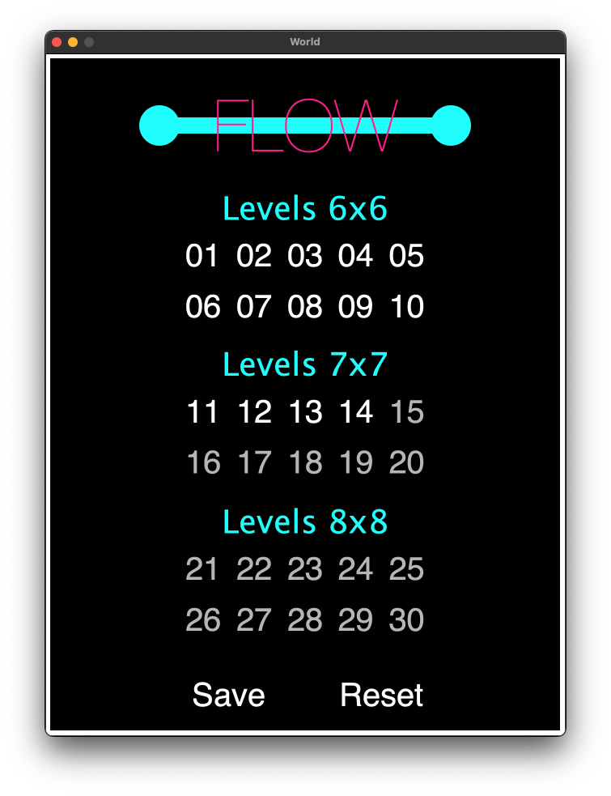
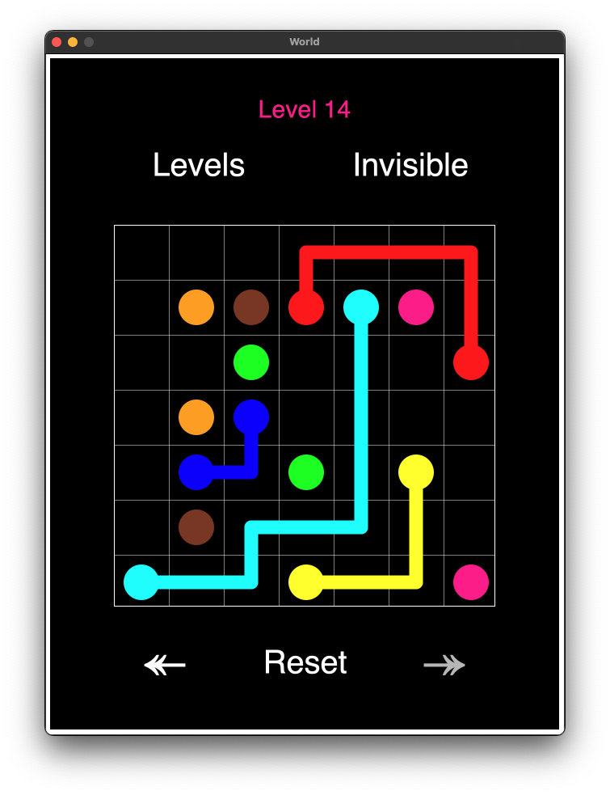

# Flow

Flow is a simple where the player has to connect colored dots.

<p align="center">
  
  
</p>

## Rules

To complete a level, the p[layer must connect all pairs of colored dots, without
overlapping lines, and by filling all empty cells on the board.

The game consists of 30 levels of increasing difficulty.

The game includes an "invisible" mode, where the lines drawn by the player are
not displayed on screen, to further increase the difficulty.

## Save file

When saving the game, a `save.txt` file will be created next to the executable.

The save file lists which levels have been unlocked, starting from 0. For
instance

```
0 1 2 3
```

unlocks the first 4 levels.

If no save file is present, the game unlocks the first level.

**N.B.: saving doesn't work using Flow.app.**

## Source code

The game is build using Racket.

You can run the app by downloading Racket (minimum version 6.0) and using
`flow.rkt` as entry point.

## Authors

The game has been developed by Amedeo Zucchetti and Vanessa Braglia.
